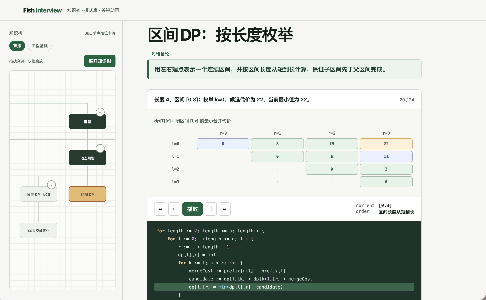

# Fish Interview

一个离线优先的 Go 面试知识查询系统：从知识树定位概念，从算法模式理解题型识别，并用逐帧动画观察算法执行。

它不是进度 Dashboard，也不以公司专区为主；公司考情只是带来源和时间边界的可聚合标签。



在线访问：[code.frozenf1sh.top](https://code.frozenf1sh.top)

## Features

- 知识树与关键词搜索
- 可引用的小知识卡片
- 贪心、动态规划、Kafka 等种子内容
- Go 生成的算法执行 Trace 与浏览器逐步播放
- 树画布保持状态，仅替换右侧卡片内容

## Run locally

```sh
mise exec go@1.26 -- go run ./cmd/fish-interview
```

Open <http://localhost:8080>.

The server listens on `0.0.0.0:8080` by default. Use `-addr 127.0.0.1:8080` for local-only binding.

## Deploy to k3s

The current deployment path is intentionally small and does not require Argo CD, CI, a registry, or a database:

```sh
bash scripts/deploy-tc.sh
```

The script builds a pinned Go/Alpine image for `linux/amd64`, imports it into the target k3s containerd through SSH, applies the manifests under `deploy/`, and waits for the rollout. For a deliberate local or uncommitted test image, pass a unique tag:

```sh
IMAGE_TAG=local-$(date +%Y%m%d%H%M%S) bash scripts/deploy-tc.sh
```

See [AGENTS.md](AGENTS.md) for the short operational checklist and rollback commands. Never commit kubeconfigs, API tokens, certificates, private keys, or Kubernetes Secret values.

## Quality checks

```sh
mise exec go@1.26 -- go test ./...
mise exec go@1.26 -- go vet ./...
git diff --check
```

See [docs/architecture.md](docs/architecture.md) for content contracts and extension boundaries.
